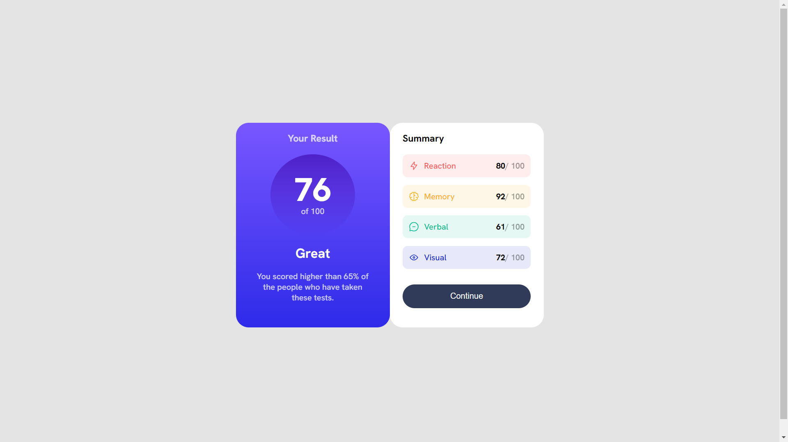

# Frontend Mentor - Results summary component solution

This is a solution to the [Results summary component challenge on Frontend Mentor](https://www.frontendmentor.io/challenges/results-summary-component-CE_K6s0maV). Frontend Mentor challenges help you improve your coding skills by building realistic projects. 

## Table of contents

- [Frontend Mentor - Results summary component solution](#frontend-mentor---results-summary-component-solution)
  - [Table of contents](#table-of-contents)
  - [Overview](#overview)
    - [The challenge](#the-challenge)
    - [Screenshot](#screenshot)
    - [Links](#links)
  - [My process](#my-process)
    - [Built with](#built-with)
    - [What I learned](#what-i-learned)
  - [Author](#author)

## Overview

### The challenge

Users should be able to:

- View the optimal layout for the interface depending on their device's screen size
- See hover and focus states for all interactive elements on the page
- **Bonus**: Use the local JSON data to dynamically populate the content

### Screenshot

### Links

- Solution URL: [github](https://github.com/NAGENDRA-BABU-MARASU/results-summary-page-FrontendMentor)
- Live Site URL: [vercel live link](https://results-summary-page-frontend-mentor.vercel.app/)

## My process

### Built with

- Semantic HTML5 markup
- CSS custom properties
- Flexbox
- Mobile-first workflow
- responsive design
  
### What I learned

- loading and creating elements from external files throught javascript
- positioning elements precisely with flexbox
- css selector combinators
- adding of svg images

## Author

- Website - [Nagendra](https://www.your-site.com)
- Frontend Mentor - [@Nagendra](https://www.frontendmentor.io/profile/NAGENDRA-BABU-MARASU)
